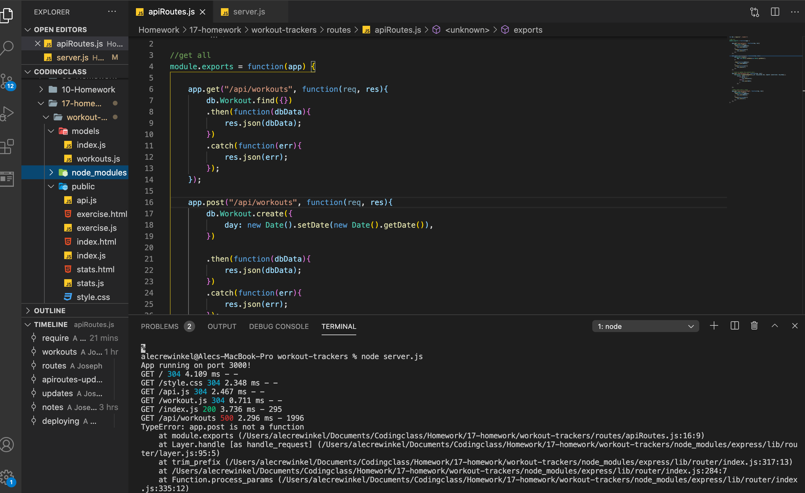

# Unit 17 Nosql Homework: Workout Tracker

For this assignment, you'll create a workout tracker. You have already been provided with the front end code in the `Develop` folder. This assignment will require you to create Mongo database with a Mongoose schema and handle routes with Express.

## User Story

* As a user, I want to be able to view create and track daily workouts. I want to be able to log multiple exercises in a workout on a given day. I should also be able to track the name, type, weight, sets, reps, and duration of exercise. If the exercise is a cardio exercise, I should be able to track my distance traveled.

## Business Context

A consumer will reach their fitness goals more quickly when they track their workout progress.

## Acceptance Criteria

When the user loads the page, they should be given the option to create a new workout or continue with their last workout.

The user should be able to:

  * Add exercises to a previous workout plan.

  * Add new exercises to a new workout plan.

  * View the combined weight of multiple exercises on the `stats` page.

To deploy an application with a MongoDB database to Heroku, you'll need to set up a MongoDB Atlas account and connect a database from there to your application. Be sure to use the following guides for support:

  * [Set Up MongoDB Atlas](../04-Supplemental/MongoAtlas-Setup.md)

  * [Deploy with Heroku and MongoDB Atlas](../04-Supplemental/MongoAtlas-Deploy.md)

## Commit Early and Often

One of the most important skills to master as a web developer is version control. Building the habit of committing via Git is important for the following two reasons:

1. Your commit history is a signal to employers that you are actively working on projects and learning new skills.

2. Your commit history allows you to revert your codebase in the event that you need to return to a previous state.

Follow these guidelines for committing:

* Make single-purpose commits for related changes to ensure a clean, manageable history. If you are fixing two issues, make two commits.

* Write descriptive, meaningful commit messages so that you and anyone else looking at your repository can easily understand its history.

* Don't commit half-done work, for the sake of your collaborators (and your future self!).

* Test your application before you commit to ensure functionality at every step in the development process.

We want you to have well over 200 commits by graduation, so commit early and often!

## Submission on BCS

You are required to submit the following:

* The URL to the deployed application

* The URL to the GitHub repository

## Problems

This assignment did present some unique challenges and ones that I have had with previous homework assignments. The problem that I had with this assignment that I have had with others is making sure that I got the routes called correctly. Since we needed to create the backend for this application, getting the apps routes to match where they were created was important. In the server.js file I was having a problem getting the routes to get both html.js and api.js incorrectly. I needed to have the syntax slightly different, and once I was able to get that figured out, I was good to go and the app started operating correctly.

## Screenshot of errors

